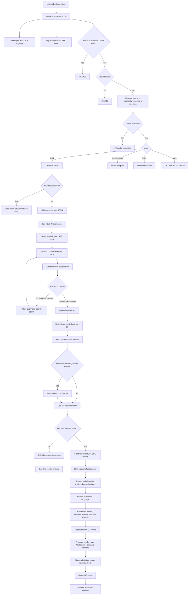
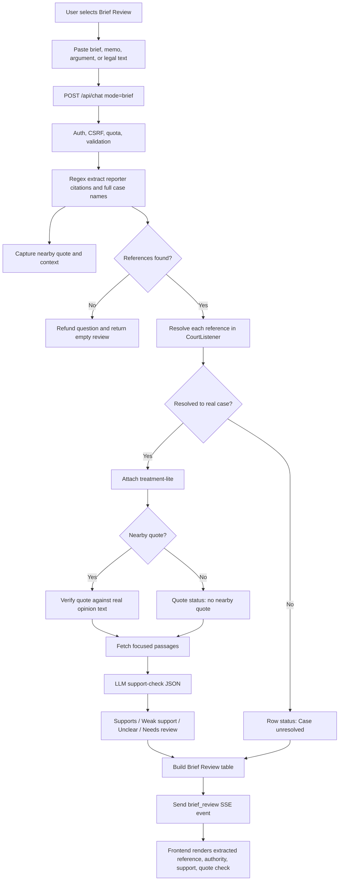

# JuriCodex

Conversational retrieval over **real US case law**. Ask a legal question in plain
language; JuriCodex finds the actual court opinions behind it — with citations
and links you can open and read yourself.

> Repo/service id: `leagle-chat` (kept as the internal name; the product brand is
> **JuriCodex**).

It is the **web chat front-end** of the legal-research engine (paired with the
`legal-mcp` connector that serves the same retrieval to Claude/agents).

## The hard rule: search, not advice

The LLM is **only a conversational front-end for SEARCH**. It:
1. turns your plain-English question into a precise case-law query (or asks one
   clarifying question), and
2. organizes the **retrieved real cases** into a readable answer, citing them `[1] [2]`.

It **never** invents cases and **never** gives a legal conclusion or predicts an
outcome. What you receive is always real primary-source material (from
CourtListener, public domain) plus citation links — not model-generated legal
content. This keeps it on the right side of unauthorized-practice-of-law and the
post-*Mata v. Avianca* hallucination risk.

If the LLM endpoint is down, **retrieval still works**: the real cases are
returned without the organizing layer. The core — real cases — never depends on
the model being up.

## Multilingual UX

The web app supports English, Spanish, Simplified Chinese, Traditional Chinese,
French, Portuguese, Korean, Japanese, and Vietnamese UI. The selected language is
saved in the browser and sent with each research request so research plans,
explanations, Brief Review support notes, and case workbench summaries are
written in that language. US case names, reporter citations, statute/regulation
citations, URLs, and quoted source text stay in their original English so the
primary law remains verifiable.

## Architecture

```
web/                 static chat UI (no build step)
  index.html
  style.css
  app.js             SSE streaming, case cards, clickable [n] citations
server/
  app.py             FastAPI: /api/chat (SSE), /api/health, serves web/
  courtlistener.py   CourtListener v4 search client → real Case objects
  llm.py             OpenAI-compatible client (route + organize), env-configured
```

Per turn: **route** (LLM → search plan) → **search** (CourtListener → real cases)
→ **organize** (LLM streams an answer grounded only in those cases).

## Answer Flow

Default `chat` mode is a multi-step grounded research flow, not a direct LLM
answer. The LLM plans/refines/explains, while legal claims are grounded in
retrieved primary-law sources.



Brief Review follows the same source-first rule, but the pipeline starts by
extracting and checking citations from pasted legal text.



The user can then inspect each source: open the full opinion, expand details and
PDF inventory, view focused passages and citing cases, copy citations, export a
Word-readable memo, or verify another quote against the real opinion text.

## Configuration (env)

| var | default | purpose |
|---|---|---|
| `LLM_BASE_URL` | `https://tianshu-gateway.cloud/v1` | OpenAI-compatible base |
| `LLM_API_KEY` | — | bearer key |
| `LLM_MODEL` | `auto` | model name |
| `COURTLISTENER_API_TOKEN` | — | optional; raises CourtListener limits (search works anonymously) |
| `LEAGLE_HOST` / `LEAGLE_PORT` | `127.0.0.1` / `8600` | bind |

## Run

```bash
pip install -r requirements.txt
python -m server.app          # or: uvicorn server.app:app --port 8600
# open http://127.0.0.1:8600
```

Search works with no keys at all (anonymous CourtListener). Set `LLM_*` to enable
the conversational query-refinement + organizing layer.

## Production Notes

Production runs behind nginx on `127.0.0.1:8600` as the dedicated `leagle-chat`
system user, not root. Keep `/opt/leagle-chat/leagle.env` and `leagle.db*` owned
by `leagle-chat:leagle-chat` with mode `600`; code, static files, and the virtual
environment can remain read-only. The systemd unit sets `UMask=0077`,
`NoNewPrivileges=true`, `PrivateTmp=true`, and `PYTHONDONTWRITEBYTECODE=1` so the
service does not need to write bytecode into the source tree.

## Roadmap

- More sources (eCFR statutes/regs, CAP historical) fused into one search ✓
- Quote verification + treatment ("is this still good law?") checks ✓
- Accounts (GitHub/Google OAuth) + saved research sessions ✓
- GPU semantic retrieval (embeddings) on top of keyword search
- Freemium billing on top of accounts

## License

[GNU AGPL-3.0](LICENSE). You may use, study, and self-host this code, but if you
run a modified version as a network service you must make your source available
to its users under the same license.
